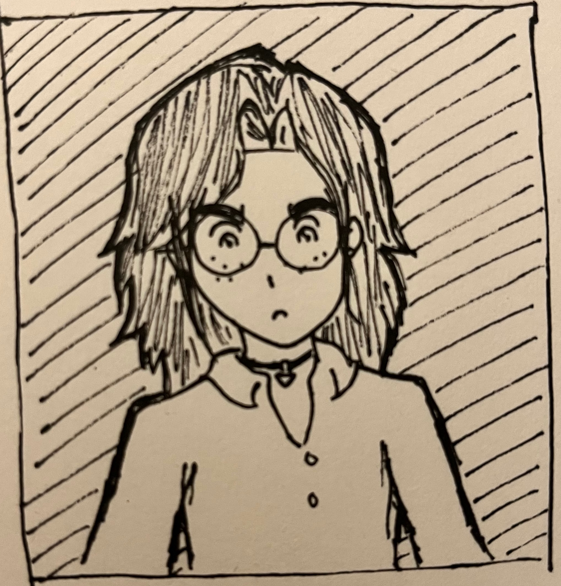
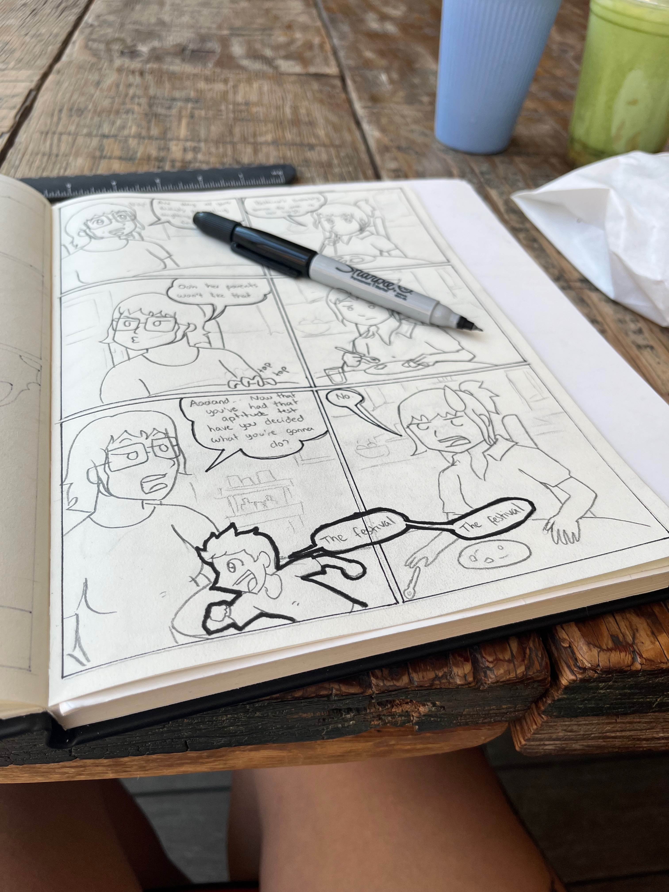

import PageHeadline from "@/components/PageHeadline.astro";
import { SITE_TITLE } from "@/consts";

<PageHeadline title={frontmatter.title} />

Hola soy Thannia, nací en 1991 y empecé a trabajar como ingeniera de software en el 2014, pero llevo dibujando comics desde la primaria.
Crecí y viví en Sonora hasta los 32 que me mudé a Canadá, y pues en Sonora no había muchas de las cosas que me gustaban en esos tiempos.

En algún punto de mi vida caí en cuenta que la fantasía siempre pasa en el bosque (obvio porque viene de Europa normalmente donde todo es bosque),
y si acaso llega a salir el desierto siempre es desierto de dunas de arena y camellos no con nopales como el que yo conozco. 

¿Sabían que los alebrijes los inventó un señor en los 80s que los soñó? Y ahora son super considerados parte del folklore mexicano. Osea que
realmente todo tuvo que ser inventado en algún momento. Los caballeros y brujas ahora se ven como algo del pasado, pero hubo un tiempo en 
el que eran el presente.

Así que quería hacer fantasía en el desierto, que a lo mejor al final no termina siendo "fantasía" tal cual (no estoy segura cómo se define el género),
no tengo estudios formales en escritura y estoy medio escribiendo las historia conforme la voy haciendo. Pero me he inspirado principalmente en RPGs.
Así como los caballeros y las brujas en su momento eran algo del presente, no me estoy limitando y estoy agregando tecnología como computadoras
en este universo. Aparte de dragones porque me gustan mucho los dragones. De este tren de pensamiento es que salió "Fragmentos de dragón".

Y con esa misma línea de pensamiento es que me estoy dando permiso de hacer lo se me antoje sin preocuparme si es cringe u original.
Me estoy divirtiendo, con que sea cool, está hecho con amor.

Aclaro sin embargo que por lo mismo, aunque todo está vagamente inspirado en cosas que hay en Sonora, he hecho 0 investigación,
los nombres de los personajes son lo primero que se me vino a la mente y no buscan seguir ninguna linea cultural (no me quería atorar
creando lingüistica para el universo). Por lo mismo si accidentalmente algo es ofensivo me disculpo. 

Todo está dibujado a mano con materiales que compré en el Dollarama, porque dibujar a mano es lo que me resulta más fácil y rápido,
he buscado quitar cualquier barrera que me detenga de terminar, y por ejemplo si me pongo a colorear cada página luego me va a dar flojera.
Hay tantitos retoques en digital después de que escaneo, como subir el contraste y quitar alguna rayita que se me fue de paso.

También todas las traducciones son hechas por mí, buscando preservar la escencia lo mejor posible, ya sé que "Fragmentos de Dragón" no es traducción directa de "Thorns of a Dragon",
escogí lo que sonaba más padre.

Crédito a quién corresponde, este sitio fue hecho a partir de esta <a href="https://astro-i18n-starter.pages.dev/en/" target="_blank">plantilla de Astro</a>

